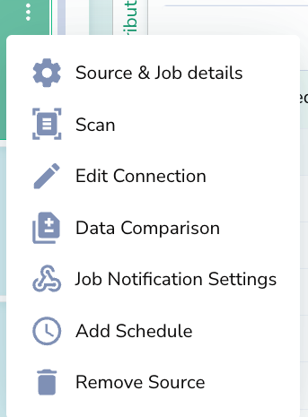
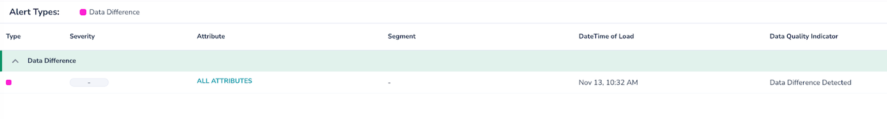
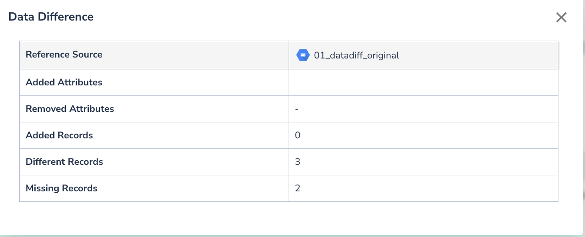

# Data Diff

Actian Data Observability allows you to compare the differences between your datasets. This feature is useful when you want to ensure data consistency across different tables, and can be used in data reconciliation or migration cases.

As part of scanning a dataset, Actian Data Observability checks for the differences between source and target tables (if configured). In the app, Actian Data Observability will provide summary stats on the number of new, missing and changed records. Outside the app, Actian Data Observability will store the changed or different records for further usage or analysis.

Actian Data Observability’s Data Diff feature runs as part of tables’ regular scan. You will first need to connect the two datasets, you want to compare,  to Actian Data Observability using the steps defined [here](https://telmai.atlassian.net/wiki/spaces/TW/pages/773881857). Then,  you will need to update the configs for the table you want to compare (target table) using these steps:

1. Define the ID Attribute
2. From the 3 dot menu, click “Data Comparison” option
3. You will be prompted to fill details:
    1. Source table: Dataset you want to compare to
    2. Result Destination: Output for parquet files (S3, Azure Blob, or GCP storage)
4. Once the details is selected, you will be prompted to fill more details on associated bucket
5. Next scan will analyze the deltas between both datasets, and alerts will be created if deltas exist
   

## Data Diff Alert Example

If any differences is detected across the source and target datasets, a “Data Difference” alert is created similar to below picture:

Clicking on the alert, will show more details on changed schema and records similar to picture below:

Lastly, navigating to the output parquet files, you can see more details on changed records, such as individual changes per each record.
