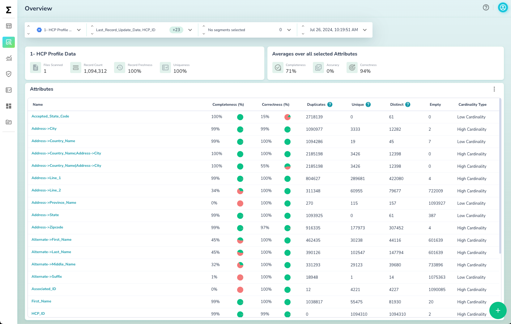
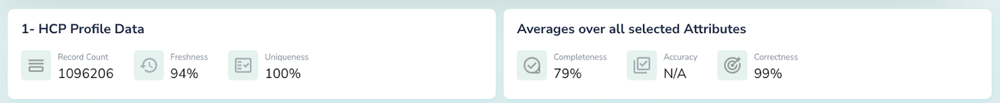
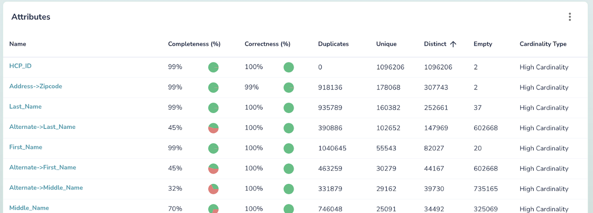

# Data Health Overview Page

The **Dataset Health Overview** page provides insights into a dataset's status and attributes during a specific scan.

On this page, you can see the Health KPIs. You can also see attribute-level metrics:

| **KPI**       | **Description**                                                                 |
| ------------- | ------------------------------------------------------------------------------- |
| _Duplicates_  | Number of records with duplicate values in the attribute                        |
| _Unique_      | Number of records with unique values in the attribute                           |
| _Distinct_    | Count of distinct values in the attribute                                       |
| _Empty_       | Count of empty values, including nulls or empty strings, in the attribute       |
| _Cardinality_ | The cardinality of values in the attribute, indicating whether it's low or high |

!!! note
    For all attribute-level metrics, table-level metrics are calculated as the average across different columns.

## Selector Component

The **Selector Component** allows you to customize the data view by selecting:

* **Dataset**: Choose the dataset you want to analyze
* **Attributes**: Select the attributes to calculate metrics on
* **Segments**: Filter the data based on specific segments
* **Scan Time**: Select the time of the data scan

## Health KPIs Summary

The **Health KPIs Summary** provides a quick overview of key Data Quality KPIs at both the table and attribute levels.

## Attribute(s) KPIs

For each attribute (or column), Actian Data Observability calculates and displays the corresponding profiling metrics.

