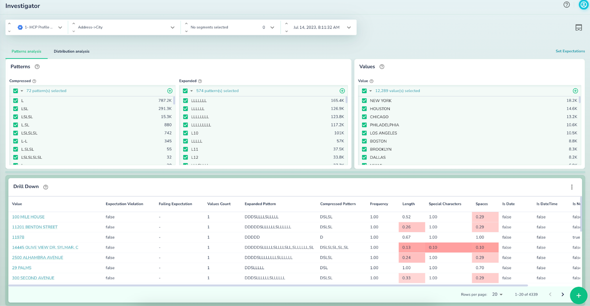

# Interactive Profiling Tool: Investigator

The **Investigator** page allows you to drill down into your dataset for a deeper analysis, similar to the Overview page

It includes a [Selector Component](https://docs.google.com/document/d/122HgJJN970V83f-i6rNIO0hhw9_obVw3-ZEE4RPo7xQ/edit#heading=h.k1kck0nxd7qj) for easy navigation and filtering.

Other components can be seen on this page:

## Patterns

This section shows the distribution of various value patterns. This can be used to understand the data and build more data validations, like enforcing specific patterns for product identifiers.

Actian Data Observability automatically calculates patterns for all attribute values. There are two kinds of patterns calculated, each of which may be useful based on the type of the data:

* Compressed Patterns - Replaces sequences of letters (L) or digits (D) with a single character
* Expanded Patterns - Replace each letter or digit with L or D, respectively

## Values

Shows the distribution of occurrences for the top values in an attribute.

## Drill Down

Provides a sample of the dataset’s top values with similar properties. Clicking on any value in this table reveals more details about its properties. This feature can also help identify data quality (DQ) validation violations.

This table can also be used to understand DQ validation violations, which will be described in a later [section](https://docs.google.com/document/d/122HgJJN970V83f-i6rNIO0hhw9_obVw3-ZEE4RPo7xQ/edit#heading=h.kgkcjzhggsi).

In this table, you can find the following columns per group/cohort of values

| **Column**            | **Description**      |
| --------------------- | ---------------------|
| Value                 | Sample data with similar characteristics |
| Expectation Violation | Indicates if the value violates a correctness expectation   |
| Failing Expectation   | The associated correctness rule (only valid for violations)  |
| Values Count          | Number of times the value appears within its attribute  |
| Expanded Pattern      | Anomaly score, based on value’s pattern, i.e. representation of the value string but with each character that belongs to one of these types: alphabet/letter (L), digit (D), or space (S) being replaced by the character representing the type. A long sequence of the same type character is represented by the character and a number indicating the length of the sequence |
| Compressed Pattern    | Anomaly score, based on value’s short pattern, i.e. representation of the value string but with each sequence of characters that belong to one of these types: alphabet/letter (L), digit (D), or space (S) being reduced to the single character representing the type  |
| Frequency             | Anomaly score based on how frequently the value occurs. A score of 1 is normal; 0 is abnormal. |
| Length                | Anomaly score based on the number of characters in the value; 1 is normal, 0 is abnormal.  |
| Special Characters    | Anomaly score based on the presence of special characters in the value; 1 is normal, 0 is abnormal.  |
| Spaces                | Anomaly score based on the number of whitespace characters; 1 is normal, 0 is abnormal. |
| Is Date               | True if value is ISO date, false otherwise |
| Is DateTime           | True if the value is a datetime, false otherwise.  |
| Is Number             | True if the value is numeric, false otherwise.  |
| Is Alpha              | True if the value consists of alphabetical characters, false otherwise.  |
