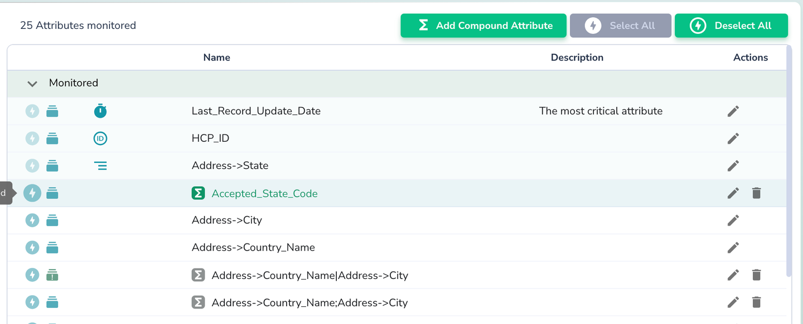
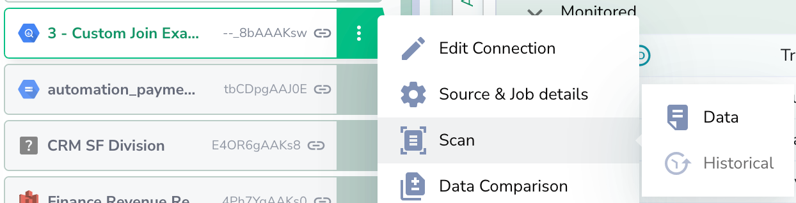
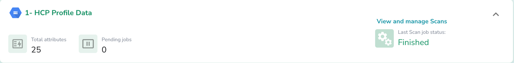

Profiling Data
==============

Before starting data profiling or monitoring, Actian Data Observability requires you to specify which attributes need to be monitored. When a data source is created, the schema is analyzed (excluding nested JSON attributes). By default, all attributes are disabled, so the first step is to enable the required ones:

1. Navigate to the **Configuration Page**.
2. Select the desired **Data Source**.
3. Click the **lightning icon** next to the attributes you want to profile. Alternatively, click **“Select All”** to enable all attributes.

Open the context menu for the same data source and select **“Scan”**.

You have two scan options:

* **Single Data Scan**
* **Historical Data Scan**

## Single Data Scan

This option launches a job to scan the current data, which can be tracked and stopped if needed:

## Historical Data Scan

For SQL-based sources with a configured schedule, you can perform a Historical scan. This option automatically breaks down records added over the past 10 periods and launches 10 independent scans for each period, allowing you to analyze historical data dynamics and metric behaviour over time.

For historical scans to work, the Timestamp Attribute (set under **Edit Connection → Advanced → Timestamp Attribute**) must be configured at the source. The column's data type should match the appropriate type for the specific database.

| Database   | Timezone Data Type       | Date Data Type |
| ---------- | ------------------------ | -------------- |
| BigQuery   | TIMESTAMP                | DATE           |
| Snowflake  | TIMESTAMP\_TZ            | DATE           |
| Iceberg    | TIMESTAMP WITH TIME ZONE | DATE           |
| Redshift   | TIMESTAMPTZ              | DATE           |
| Athena     | timestamp with time zone | date           |
| Databricks | TIMESTAMP                | DATE           |
| SQL Server | DATETIMEOFFSET           | DATE           |
| Trino      | timestamp with time zone | date           |

