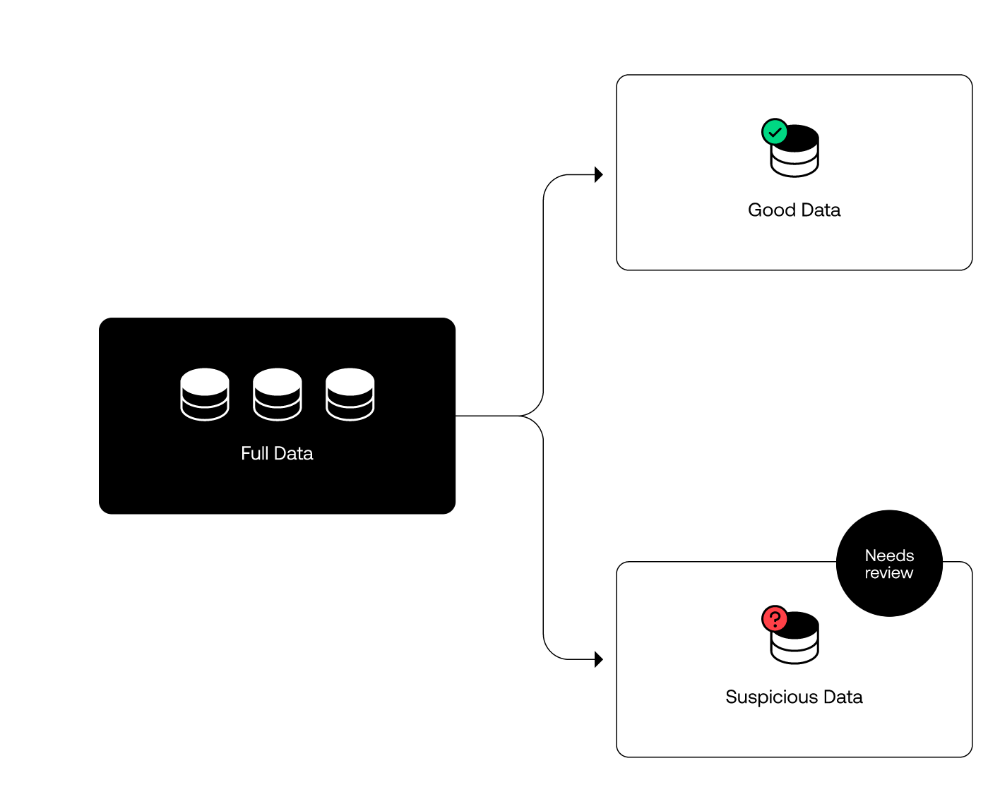
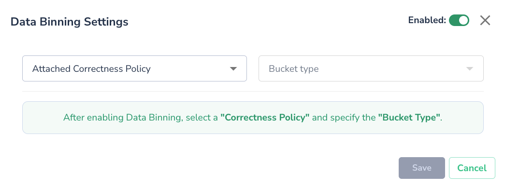
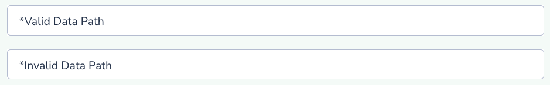

# Data Binning

## Data Binning Policy

Actian Data Observability offers a data binning feature to help manage data quality issues at the source. This feature allows you to define a policy where Actian Data Observability monitors data correctness and categorizes your data into "good" and "bad" bins. Good data continues through your pipeline, while bad or suspicious data is flagged for review

This feature can help you ensure that only good (or expected) data is flowing into your ecosystem. By doing so, you can ensure that your costly pipelines are only running on healthy datasets

To enable this feature for a connected data source, you will need to:

1. Configure the ID Attribute: Set the ID attribute for the data source
2. Set Data Expectation Rules: Define rules on the "Data Quality Rules" page
3. Navigate to the "Alerting Policy" page and create a correctness policy. This policy will be used for scoping.
4. You are now able to set your Data Binning policy
5. Click on **Enable Data Binning** button, a prompt will ask you to define the policy details:

1. Select previously created correctness policy
2. Pick desired bucket type (AWS-S3, GCP-Storage or Azure-Blob)
    1. Once selected, you will need to enter the credentials
3.  You will then need to define:

    1. _Valid Data Path:_ Path for good data (correct data)
    2. _Invalid Data Path:_ Path for bad data (incorrect data)

Once enabled, the binning will automatically take effect in your next data scan job.

!!! note
    Data Binning to Azure-storage, the SAS key used must have delete permissions.
