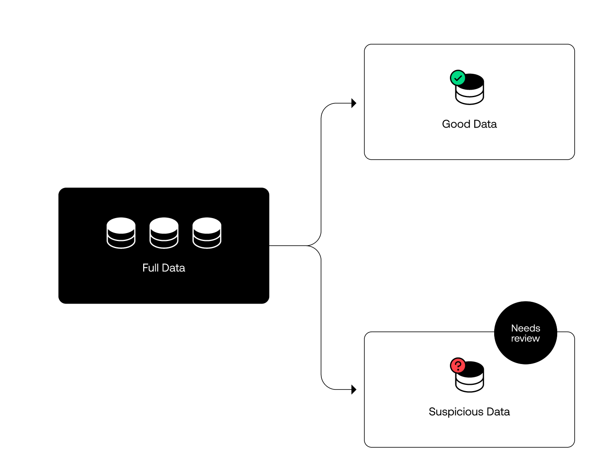

# Data Binning

## Data Binning Policy

Actian Data Observability offers a data binning feature to help manage data quality issues at the source. This feature allows you to define a policy where Data Observability monitors data correctness and categorizes your data into "good" and "bad" bins. Good data continues through your pipeline, while bad or suspicious data is flagged for review

This feature can help you ensure that only good (or expected) data is flowing into your ecosystem. By doing so, you can ensure that your costly pipelines are only running on healthy datasets

To learn more about using this feature, please check [Configuring Data-Binning](../monitoring-data/monitors-management/configuring-data-binning.md) documentation.