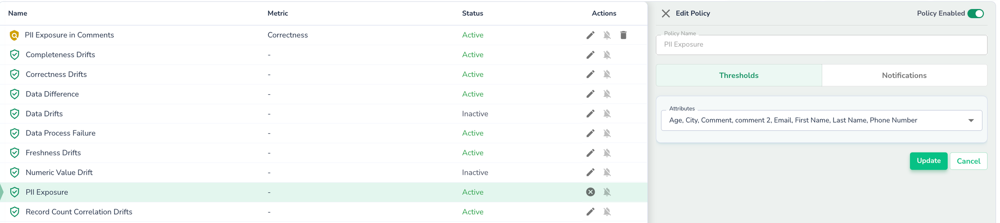
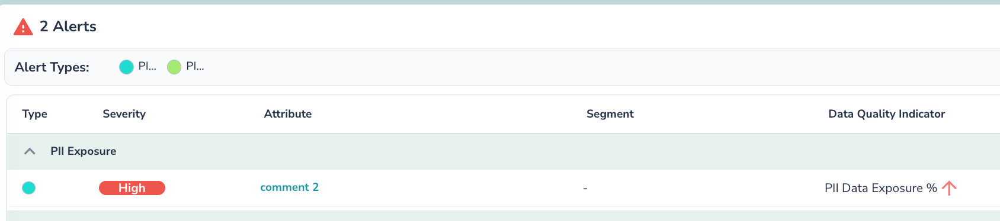
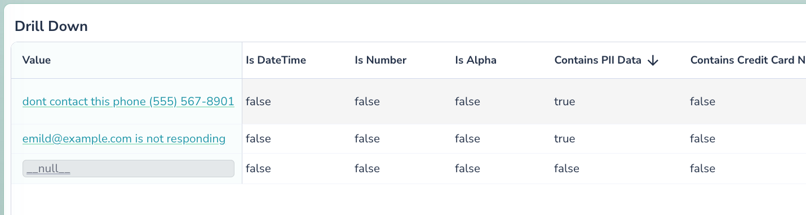
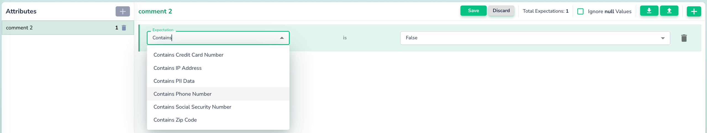
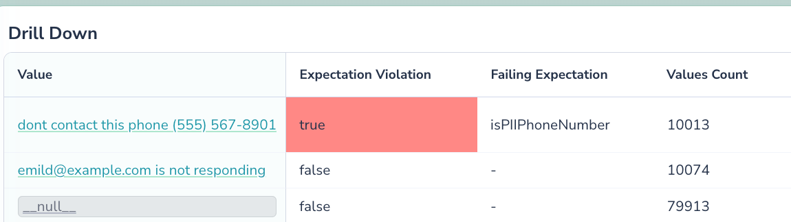

PII Data Detection
===================

Actian Data Observability's PII Data Detection feature enables seamless identification of Personally Identifiable Information (PII) within monitored attributes. This functionality helps organizations proactively manage data privacy risks by detecting and alerting PII exposure, ensuring compliance, and enhancing data governance.

## How to Enable PII Detection

1. Navigate to the [**Alerting Policies**](getting-started/monitoring-data/monitors-management/configuring-notifications.md) Page:
   1. Select the **PII Exposure Policy**.
   2. Enable the policy (disabled by default).
   3. Optionally, limit the scope to specific attributes for focused detection.
2. Configure alert delivery through supported channels such as email, Teams, or webhooks to set up notifications.
3. Alerts display detected PII exposure, including attribute-level details.
4. Initiate a manual scan or wait for the next scheduled scan. Detected PII will automatically generate alerts.
   
   In the picture above it detected PII Exposure in attribute “comment 2“. By clicking on the attribute name it will navigate to Investigator page to inspect values which were detected as violations.
5.  On the Investigator page, navigate to the Values table and scroll to the right to observe additional fields, which now include “Contains PII”, “Contains Phone”, etc.
   
   In the example above Contains PII field displays true for 2 of the values, which means it contains PII data. Same for other fields, representing other classes of PII Data, ex. Credit Card Number, Phone etc.

## PII Data Validation Rules 

Actian Data Observability's rules engine supports custom validation and remediation of PII data violations. This includes actions like segregating PII-exposing records using [Data Binning](getting-started/remediation/data-binning.md).

1. **Create a Rule**:
   1. Navigate to the **Correctness Rules Page**.
   2. Add a rule for the desired attribute (e.g., "Contains Phone Number").
   3. Set the expected value (`True` for mandatory presence, `False` for exclusion).
       
      Select appropriate detector, like **Contains Phone Number** and pick the expected value. If you want to ensure data doesn’t contain phones then select **False**. If you want to make sure it’s nothing but phones select True.
2. You can trigger the scan or let the scheduled scan complete. Create a custom correctness policy with thresholds (e.g., \[100,100]) to ensure alerts for detected violations.
3. You can trigger the scan or let the scheduled scan complete. To inspect violations, navigate to Investigator by clicking on the attribute name.
   
   Attributes flagged with PII exposure are highlighted in the Investigator page.
4. Values that failed the check will have Expectation Violation marked as true (highlighted red) next to them. Fields like **"Contains PII"** and **"Contains Phone"** show detection statuses (e.g., `True` for PII presence).